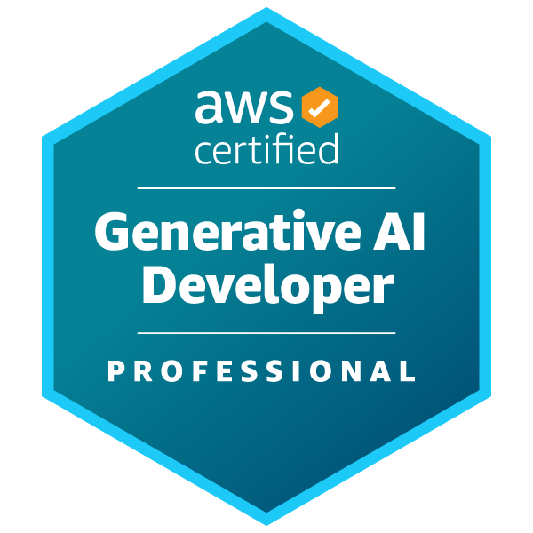
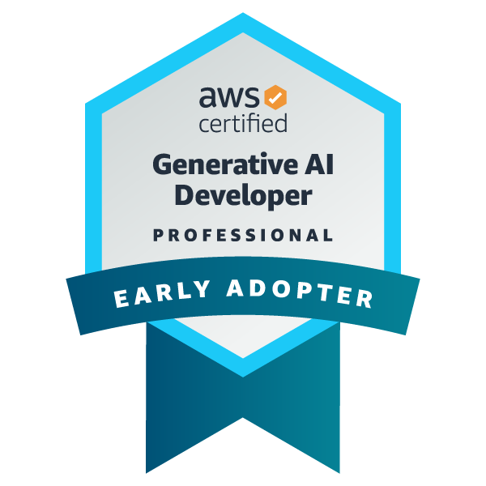
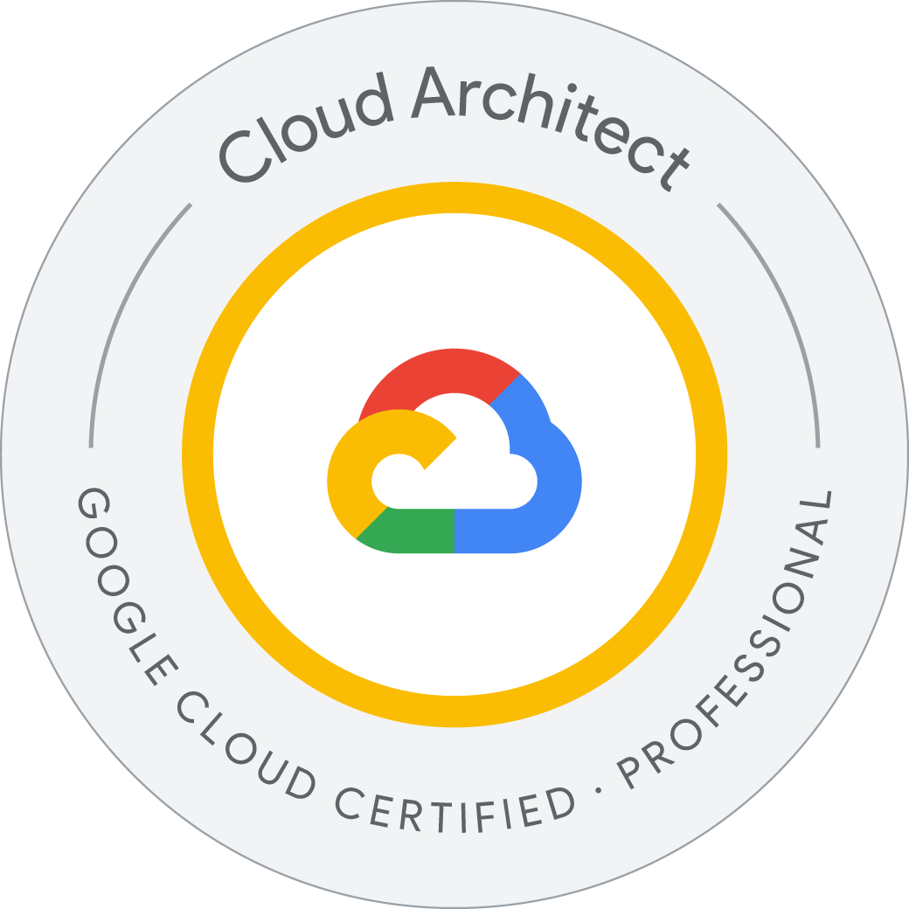

# Davis Sylvester

📍 Van Alstyne, TX\
📞 (214) 223-1413\
📧 dsylvesteriii@gmail.com

------------------------------------------------------------------------

## 🚀 Objective

Experienced Lead Solution Architect and hands-on backend developer
specializing in robust cloud and microservice architectures with
**Node.js** and **TypeScript**. Proven leader of cross-functional teams
delivering scalable solutions on **AWS** and **Azure**. Certified **AWS
Solutions Architect -- Professional** and **Azure Solutions Architect
Expert**, with deep expertise in DevOps, CI/CD, and Infrastructure as
Code using Terraform and GitHub Actions.

------------------------------------------------------------------------

## 🧠 Areas of Expertise

### 💻 Programming Languages

-   C#
-   JavaScript / TypeScript (Node.js, Bun, Deno)
-   Python

### 🌐 Frontend Frameworks

-   Angular
-   Vue
-   React

### 🗄️ Databases

-   MS SQL, MySQL, MariaDB
-   PostgreSQL
-   MongoDB
-   DynamoDB

### ☁️ Cloud & DevOps

  Area              Tools
  ----------------- --------------------------------------
  Cloud Providers   AWS, Azure
  CI/CD             GitHub Actions, Jenkins, CircleCI
  IaC               Terraform, AWS CDK, Pulumi
  Containers        Docker, Kubernetes, AWS ECS, AWS EKS

### 🔧 Backend & Tooling

-   .NET / .NET Core
-   Django, Flask
-   Kafka, RabbitMQ
-   Entity Framework, TypeORM
-   OpenAPI / Swagger
-   xUnit, Jest, Playwright

### 🖥️ Platforms & Tools

-   Linux (Ubuntu, CentOS, Debian)
-   Visual Studio, VS Code, Android Studio
-   Lucidchart, Draw.io, Confluence

------------------------------------------------------------------------

## 🏅 Certifications

-  AWS Certified Generative AI Developer — Professional
-  AWS Certified Generative AI Developer — Professional Early Adopter
-  Google Cloud Professional Cloud Architect
-  AWS Certified Solutions Architect — Professional
-  Microsoft Certified: Azure Fundamentals
-  AWS Certified Solutions Architect — Associate
-  AWS Certified Cloud Practitioner
-  AWS Certified Developer — Associate

------------------------------------------------------------------------

## 💼 Work Experience

### 🏢 The Sylvester Group LLC

**Solution Architect** \| Mar 2023 -- Present

-   Built secure Node.js APIs using Auth0 and AWS Cognito for
    authentication and authorization.
-   Implemented CI/CD pipelines with AWS CDK and GitHub Actions.
-   Developed Azure Container Apps to sync Oracle to MongoDB in real
    time.
-   Authored FHIR APIs producing Kafka events for healthcare systems.

**Core Stack:** Node.js, AWS CDK, ECS, Docker, Azure Container Apps,
MongoDB, Kafka

------------------------------------------------------------------------

### ☁️ Amazon Web Services (ProServe) -- Remote

**Solution Architect** \| Aug 2019 -- Mar 2023

-   Designed cloud-native Node.js backends for global enterprise
    customers.
-   Delivered Infrastructure as Code using AWS CDK (TypeScript).
-   Built scalable serverless systems with AWS Lambda.
-   Deployed containerized Node.js apps on Amazon ECS.
-   Created multi-region CI/CD pipelines via GitHub Actions.

------------------------------------------------------------------------

### 🏗️ Davaco LP

**Sr. Software Architect** \| Feb 2015 -- Aug 2019

-   Developed Node.js Web APIs.
-   Led migration from on-prem to Azure using Terraform CDK.
-   Containerized microservices on Azure Functions with Swagger docs.
-   Designed backend build and deployment systems.
-   Migrated legacy apps to Docker and Azure App Services.

## 🕘 Prior Experience

## 🕘 Prior Experience (Senior Developer Roles)

-   State Farm -- Sr. Full Stack Developer\
-   Homing Realty -- Sr. Full Stack Developer\
-   RevUnit -- Sr. Full Stack Developer\
-   Mortgage Specialist International -- Sr. C# Developer\
-   Snelling Staffing -- VB & C# Developer\
-   Advanced Data Spectrum -- C# Developer\
-   Better Video -- JavaScript Developer\
-   Zales Corporation -- C# Developer\
-   DS3 Computing Solutions -- C# & Web Developer

------------------------------------------------------------------------

## 🧩 Core Strengths

-   Event-driven and microservice architectures
-   Secure API design (OIDC/OAuth2)
-   Serverless and container orchestration
-   Automated multi-environment deployments
-   Cross-cloud (AWS + Azure) solution design

------------------------------------------------------------------------

## 📫 Contact

**Davis Sylvester**\
📧 dsylvesteriii@gmail.com\
📞 (214) 223-1413
